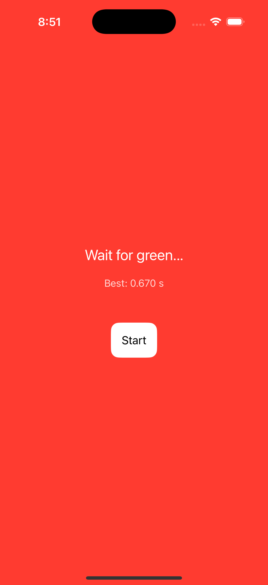
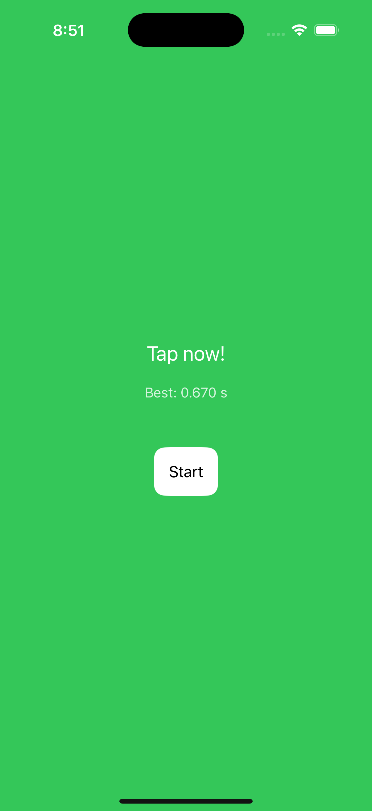
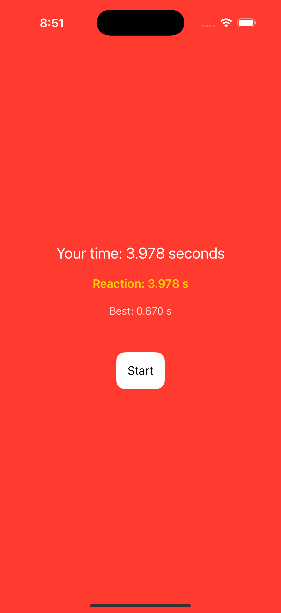

# ⚡️ iOS Reaction Time App

Measure your reflexes and track your personal bests with this sleek and intuitive iOS Reaction Time app built using **Swift**, **SwiftUI**, and **Xcode**.

## 📲 Overview

This app challenges users to tap the screen as quickly as possible when the color changes. It's simple, addictive, and perfect for anyone curious about their reaction speed.

## 🛠️ Tech Stack

- **Swift & SwiftUI** – Modern declarative UI framework
- **Xcode** – Development and testing
- **State Management** – `@State`, `@ObservedObject`, `@StateObject`
- **UserDefaults** – Persistent storage for personal best scores

## ✨ Features

- 🎯 Reaction time test with instant feedback
- 📈 Personal best tracking
- 🔁 Quick restart for repeated testing

## 📸 Screenshots

> Add your screenshots below by replacing the placeholder paths with actual image links or local paths.

| Home Screen | Wait Display | Tap Display | Score & Personal Best |
|-------------|---------------|----------------|----------------|
|  |  |  |  |

<!--TODO:
    ## 🎥 Demo Video

> Embed or link your demo video here.

[▶️ Watch Demo](https:) -->

## 💡 Use Cases

- 🕹️ **Gamers** – Sharpen reflexes for competitive edge
- 🏃 **Athletes** – Track and improve reaction time for performance
- 🧪 **Educators** – Demonstrate human reflexes in classrooms
- 🎉 **Casual Users** – Challenge friends and beat your own records

## 🚀 Getting Started

1. Clone the repository:
   ```bash
   git clone git@github.com:yosupCheon/iOS-Reaction-Time-App.git
